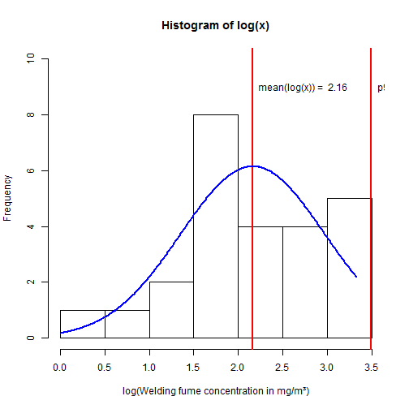

Welding1979
========================================================
author: Tom Geens
date: 19/02/2016
autosize: true

The 1979 Welding Fume Dataset
========================================================
In 1979, [Evans, Ingle, Molyneux, Sharp and Swain](https://annhyg.oxfordjournals.org/content/22/1/1.abstract",target="_new"),  published a paper on welding fume exposure. The dataset contains 25 samples representing workers' exposure in mg/m³.


```r
wf<-c(8.8,3.9,7.3,17.0,23.1,6.7,5.2,4.8,2.5,5.8,4.2,27.9,1.0)
wf<-c(wf,6.9,20.5,5.3,25.2,19.1,8.5,6.0,15.0,25.8,14.6,9.2,11)
lnwf<-log(wf); welding<-data.frame(wf,lnwf); summary(welding)
```

```
       wf             lnwf      
 Min.   : 1.00   Min.   :0.000  
 1st Qu.: 5.30   1st Qu.:1.668  
 Median : 8.50   Median :2.140  
 Mean   :11.41   Mean   :2.162  
 3rd Qu.:17.00   3rd Qu.:2.833  
 Max.   :27.90   Max.   :3.329  
```

Histograms of the original and log-transformed values
========================================================


***


